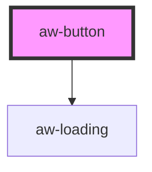

# aw-button

A simple button with styles of Anywhere Design System applied.

<!-- Auto Generated Below -->

## Properties

| Property             | Attribute   | Description                                                                                            | Type                                                                                                              | Default                 |
| -------------------- | ----------- | ------------------------------------------------------------------------------------------------------ | ----------------------------------------------------------------------------------------------------------------- | ----------------------- |
| `color`              | `color`     | Colors of button (like gradient)                                                                       | `AwButtonColor.basic \| AwButtonColor.gradient \| AwButtonColor.outline \| AwButtonColor.solid`                   | `AwButtonColor.solid`   |
| `disabled`           | `disabled`  | Boolean to indicate if button is disabled                                                              | `boolean`                                                                                                         | `false`                 |
| `fullWidth`          | `fullwidth` | If `true` button use `width: 100%`                                                                     | `boolean`                                                                                                         | `false`                 |
| `icon`               | `icon`      | Icon class from FontAwesome 5 Free Allows to use: brands, regular, solid Example: 'far fa-paper-plane' | `string`                                                                                                          | `undefined`             |
| `iconMode`           | `iconmode`  | Position of icon                                                                                       | `AwButtonIconMode.left \| AwButtonIconMode.right`                                                                 | `AwButtonIconMode.left` |
| `id`                 | `id`        | Optional ID to be attached on button                                                                   | `string`                                                                                                          | `undefined`             |
| `label` _(required)_ | `label`     | Text to show inside button                                                                             | `string`                                                                                                          | `undefined`             |
| `loading`            | `loading`   | Add a loading indicator to button You need add a manual control to remove loading                      | `boolean`                                                                                                         | `false`                 |
| `mode`               | `mode`      | Mode of button (like square or rounded)                                                                | `AwButtonMode.radius \| AwButtonMode.rounded \| AwButtonMode.square`                                              | `AwButtonMode.rounded`  |
| `onlyIcon`           | `onlyicon`  | If `true` button removes label                                                                         | `boolean`                                                                                                         | `false`                 |
| `size`               | `size`      | Size of button                                                                                         | `AwButtonSize.giant \| AwButtonSize.large \| AwButtonSize.medium \| AwButtonSize.small \| AwButtonSize.tiny`      | `AwButtonSize.large`    |
| `status`             | `status`    | The status of button (color)                                                                           | `AwStatus.danger \| AwStatus.info \| AwStatus.primary \| AwStatus.secondary \| AwStatus.success \| AwStatus.warn` | `AwStatus.primary`      |
| `theme`              | `theme`     |                                                                                                        | `"dark" \| "light"`                                                                                               | `defaultTheme`          |

## Events

| Event     | Description                                                                                                         | Type                   |
| --------- | ------------------------------------------------------------------------------------------------------------------- | ---------------------- |
| `clicked` | Emitted when button is clicked Captured by onClick listener. > Note: if button was disabled event can't be dispatch | `CustomEvent<UIEvent>` |

## Dependencies

### Depends on

- [aw-loading](../aw-loading)

### Graph

----------------------------------------------

*Built with [StencilJS](https://stenciljs.com/)*
