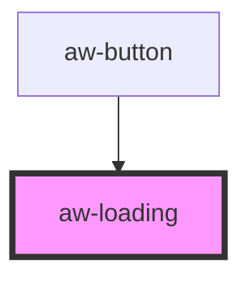

# aw-loading

<!-- Auto Generated Below -->

## Properties

| Property  | Attribute | Description | Type                                                                                                              | Default            |
| --------- | --------- | ----------- | ----------------------------------------------------------------------------------------------------------------- | ------------------ |
| `status`  | `status`  |             | `AwStatus.danger \| AwStatus.info \| AwStatus.primary \| AwStatus.secondary \| AwStatus.success \| AwStatus.warn` | `AwStatus.primary` |
| `visible` | `visible` |             | `boolean`                                                                                                         | `false`            |

## Dependencies

### Used by

 - [aw-button](../aw-button)

### Graph

----------------------------------------------

*Built with [StencilJS](https://stenciljs.com/)*
